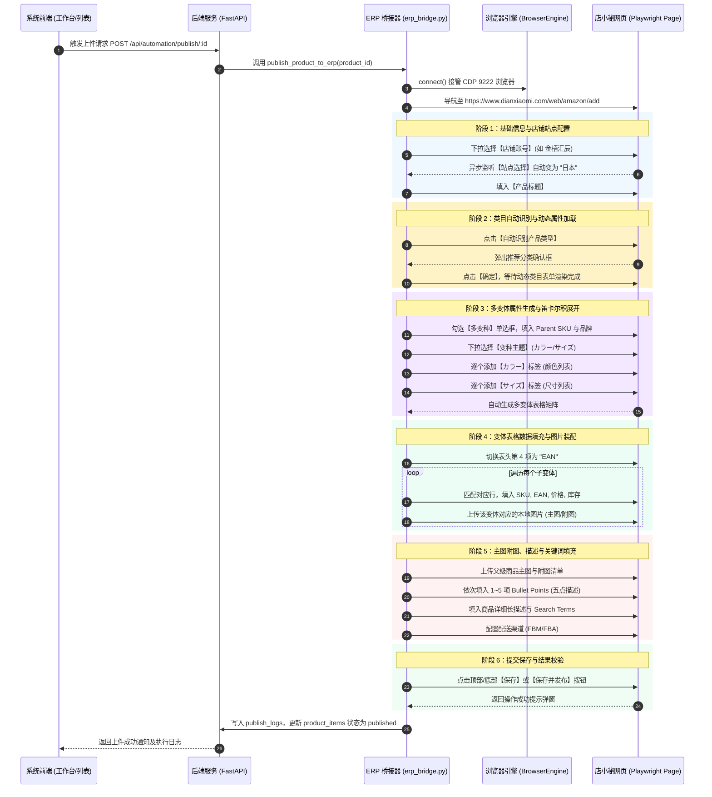

# 跨境电商商品录入系统：店小秘 ERP 自动化上件集成方案与字段映射规范

> **文档版本**：v1.0.0  
> **更新时间**：2026-08-30  
> **目标页面**：店小秘--添加亚马逊产品 (`https://www.dianxiaomi.com/web/amazon/add`)  
> **数据来源**：系统核心单表 `product_items`（父子 SKU 层级合并架构）与 `sku_ean_mappings`

---

## 一、方案概述与设计原则

本方案旨在打通**本地商品录入系统**与**店小秘（Dianxiaomi）ERP 亚马逊商品发布模块**，利用 Python Playwright 原生 CDP（Chrome DevTools Protocol）协议，实现从结构化商品数据、变体矩阵、本地图片路径到店小秘页面的**一键无死角自动化填充、核验与发布**。

### 核心设计原则
1. **100% 字段对齐**：系统录入工作台（Card 1 ~ Card 10）所有可见字段与店小秘页面元素一一对应，杜绝数据遗漏；
2. **变体矩阵智能映射**：自动识别多变体属性维度（颜色、尺寸），触发笛卡尔积展开，并精准定位变体表格各行填入 SKU、EAN、价格与库存；
3. **本地图片全自动装配**：自动将数据库中保存的相对路径（如 `1/main.jpg`）转换为 Windows/macOS 绝对路径，并批量/按变体维度上传；
4. **弹窗与异步加载自适应**：智能处理类目自动识别弹窗、站点联动等待、表格动态渲染等异步时序问题；
5. **全程日志与进度可追溯**：执行过程实时记录至 `publish_logs` 表，并在前端界面提供阶段进度反馈。

---

## 二、系统字段与店小秘页面【字段映射全景矩阵】

下表完整定义了本系统 `product_items` 单表字段与店小秘亚马逊刊登页面的映射关系、选择器及填写规则：

| 序号 | 系统功能模块 | 数据库字段 (`product_items`) | 字段类型 | 适用层级 | 店小秘页面区域 | 店小秘字段名 / 控件 | 定位器 (CSS / Visual Locator) | 填充与交互规则 |
| :---: | :--- | :--- | :--- | :---: | :--- | :--- | :--- | :--- |
| **1** | 1. 店铺与基础 | `store_account` | `TEXT` | 父独有 | `basicInfo` | **店铺账号** (下拉选择) | `#rc_select_0` / `label: "店铺账号"` | 下拉选中对应店铺（如 `金梧汇辰`），监听并等待站点自动切换为 `日本` |
| **2** | 1. 店铺与基础 | `title` | `TEXT` | 父独有 | `basicInfo` | **产品标题** (单行文本) | `input[placeholder="请输入"]` | 填入日文商品标题，触发 `input` 与 `change` 事件 |
| **3** | 1. 店铺与基础 | `sale_type` | `TEXT` | 父独有 | `basicInfo` | **售卖形式** (单选框) | `input[name="saleType"]` | 值为 `variation` 时勾选【多变种】，`single` 时勾选【单品】 |
| **4** | 1. 店铺与基础 | *(动态触发)* | - | 父独有 | `basicInfo` | **产品分类** (操作按钮) | 按钮: `自动识别产品类型` | 点击按钮 ➔ 等待推荐弹窗出现 ➔ 点击【确定】加载类目动态属性 |
| **5** | 2. 产品信息 | `parent_sku` | `TEXT` | 父 & 子 | `productInfo` | **Parent SKU** (单行文本) | `input[placeholder*="Parent"]` | 填入父级 SKU 编码（如 `DOG-TOILET-PARENT`） |
| **6** | 2. 产品信息 | `brand` | `TEXT` | 父独有 | `productInfo` | **品牌** (下拉/输入) | `#rc_select_6` / `label: "品牌"` | 填入/选定店铺绑定的品牌（如 `JINWU` / `Hiremo`） |
| **7** | 4. 产品图片 | `main_image` | `TEXT` | 父独有 | `imageInfo` | **产品图片 - 主图** | `.img-module` 主图槽位 | 转换为本地绝对路径，调用文件选择器上传至产品主图槽位 |
| **8** | 4. 产品图片 | `extra_images_json` | `TEXT (JSON)` | 父独有 | `imageInfo` | **产品图片 - 附图 (1~8)** | `.img-module` 附图槽位列表 | 遍历 JSON 相对路径列表，按顺序上传至附图槽位 |
| **9** | 5. 变体属性 | `variation_theme` | `TEXT` | 父独有 | `variationInfo` | **变种主题** (下拉选择) | 下拉选择器 / `label: "变种主题"` | 下拉选中对应主题（如 `カラー/サイズ(颜色/尺寸)`） |
| **10** | 5. 变体属性 | `color_options_json`| `TEXT (JSON)` | 父独有 | `variationInfo` | **カラー(颜色)** 标签维护 | 动态 Tag 输入框 + 确认 | 解析 JSON 数组（如 `["ブラック", "ホワイト"]`），逐个添加颜色属性标签 |
| **11** | 5. 变体属性 | `size_options_json` | `TEXT (JSON)` | 父独有 | `variationInfo` | **サイズ(尺寸)** 标签维护 | 动态 Tag 输入框 + 确认 | 解析 JSON 数组（如 `["S", "M", "L"]`），逐个添加尺寸标签，触发笛卡尔积表格渲染 |
| **12** | 7. 变体表格 | *(固定设为 EAN)* | - | - | `variationInfo` | **表头第4项 (ID类型)** | `thead th:nth-child(4) .ant-select` | 切换表头 ID 类型为 `EAN` |
| **13** | 7. 变体表格 | `sku` | `TEXT` | 子变体 | `variationInfo` | **变体 SKU** (表格输入) | 对应行 `input[placeholder*="SKU"]` | 根据变体组合（颜色/尺寸）定位指定行填入子 SKU |
| **14** | 7. 变体表格 | `ean` | `TEXT` | 子变体 | `variationInfo` | **EAN 条码** (表格输入) | 对应行 `input[placeholder*="ID/条码"]` | 填入分配的 13 位标准 EAN-13 条码 |
| **15** | 7. 变体表格 | `price_jpy` | `REAL` | 子变体 | `variationInfo` | **价格 (JPY)** (表格输入) | 对应行 `input[placeholder*="价格"]` | 填入智能测算的日元最终售价（如 `3980`） |
| **16** | 7. 变体表格 | `quantity` | `INTEGER` | 子变体 | `variationInfo` | **库存数量** (表格输入) | 对应行 `input[placeholder*="数量/库存"]`| 填入子变体库存（如 `40`） |
| **17** | 6. 变体图片录入 | `variant_image` 或 维度映射 | `TEXT` | 子变体 | `variationInfo` | **变体主图 / Swatch** | 表格内各行图片上传组件 | 根据 Card 6 维度映射或子变体图，上传对应本地变体图片 |
| **18** | 8. 描述信息 | `bullet_points_json`| `TEXT (JSON)` | 父独有 | `descriptionInfo` | **Bullet Points (1~5)** | `#form_item_bulletPoints_0`~`4` | 依次填入 1~5 项日文五点描述内容 |
| **19** | 8. 描述信息 | `description` | `TEXT` | 父独有 | `descriptionInfo` | **商品描述 (Description)** | CKEditor 富文本编辑器 / `#cke_...` | 填入带序号的日文详细商品描述 |
| **20** | 9. 运输信息 | `fulfillment_channel`| `TEXT` | 父独有 | `shippingInfo` | **配送渠道** (下拉单选) | `#rc_select_7` / `label: "配送渠道"` | 选择 `FBM`（卖家自配送）或 `FBA` |
| **21** | 10. 关键词 | `search_terms` | `TEXT` | 父独有 | `keywordInfo` | **Search Terms** (多行文本) | `textarea.ant-input.w-800` | 填入 250 字符限制内的日文搜索关键词 |
| **22** | 3. 产品属性 | `model_number` | `TEXT` | 父独有 | `attrInfo` | **品番・型番 (Part Number)**| 动态类目属性对应 input | 若类目展开了型号/品番字段，自动匹配并填入 |
| **23** | 3. 产品属性 | `model_name` | `TEXT` | 父独有 | `attrInfo` | **モデル名 (Model Name)** | 动态类目属性对应 input | 若类目展开了型号名称字段，自动匹配并填入 |
| **24** | 3. 产品属性 | `item_length` ~ `height` | `REAL` | 父独有 | `attrInfo` | **品目寸法 (长/宽/高及单位)**| 动态类目尺寸输入组 | 自动填入商品长宽高及 `cm` 单位 |
| **25** | 3. 产品属性 | `package_length` ~ `wt` | `REAL` | 父独有 | `attrInfo` | **包装寸法与重量** | 动态类目包装输入组 | 自动填入包装长宽高及重量（`kg`） |

---

## 三、自动化上件 7 阶段执行时序流程图

---

## 四、核心业务处理与复杂场景策略

### 1. 变体图片上传的两种适配模式
系统支持 Card 6 维护的**维度级图片映射**与 Card 7 **独立子变体图片**两种模式：
* **模式 A（按属性维度映射，如按颜色）**：
  若 `variant_image_dimension = 'color'`，读取 `variant_dimension_images_json`（如 `{"黑色": "1/black.jpg", "白色": "1/white.jpg"}`），程序在遍历变体行时，相同颜色的所有尺码自动复用对应颜色的本地图片上传。
* **模式 B（子变体独立图）**：
  若各子变体拥有独立的 `variant_image`，直接将对应的子变体图片上传至对应行。

### 2. 本地图片路径转换与安全上传
* 数据库中存储统一的相对路径规范（如 `1/main.jpg`、`1/extra1.jpg`）；
* 桥接服务在调用 Playwright 前，调用 `FileService.resolve_image_path(rel_path)` 解析为操作系统的绝对路径（例如 Windows 下 `D:\products\1\main.jpg`）；
* 上传前检测 `os.path.exists(abs_path)`，若文件不存在则记录警告日志并优雅跳过，不阻断主流程。

### 3. 异步弹窗与时序等待机制
* **店小秘类目识别等待**：使用 `page.wait_for_selector(".ant-modal", timeout=8000)` 配合 `confirm_modal("确定")`，并在确定后执行 `page.wait_for_timeout(2000)`，确保动态分类属性完全挂载到 DOM。
* **变体表格渲染等待**：添加完最后一个尺寸标签后，等待 `#variationInfo table tbody tr` 的数量等于 `len(colors) * len(sizes)`，确认表格生成完毕后再开始填充。

---

## 五、代码落地与改动计划

### 1. 后端服务层改造
* **文件**：[`server/services/erp_bridge.py`](file:///d:/myCoding/AmazonListingAssistant/server/services/erp_bridge.py)
* **改动点**：
  1. 重构数据读取逻辑，完全对接 `product_items` 单表（同时读取 `is_parent=1` 的父属性与 `is_parent=0` 的子变体列表）；
  2. 补齐五点描述（`#form_item_bulletPoints_0~4`）、商品描述、Search Terms、配送渠道及尺寸重量参数的自动填充；
  3. 优化店小秘表单操作异常重试与日志收集。

### 2. 前端交互与状态联动
* **商品列表页 [`server/templates/list.html`](file:///d:/myCoding/AmazonListingAssistant/server/templates/list.html)**：
  在操作列增加 **「🚀 上传店小秘」** 快捷操作按钮，点击后弹出实时进度日志 Modal。
* **商品录入页 [`server/templates/entry.html`](file:///d:/myCoding/AmazonListingAssistant/server/templates/entry.html)**：
  在底部悬浮操作栏增加 **「💾 保存并上传店小秘」** 按钮，支持录入完毕后一键直达上件。
* **前端脚本 [`server/static/js/app.js`](file:///d:/myCoding/AmazonListingAssistant/server/static/js/app.js)**：
  实现上传进度轮询与 Toast 状态展示。

---

## 六、测试与验收清单

| 验收项 | 测试用例 | 预期结果 |
| :--- | :--- | :--- |
| **基础配置** | 单品/多变体商品上传 | 店铺账号、日本站点、产品标题准确填入 |
| **类目识别** | 自动识别产品类型 | 成功触发识别并自动点击弹窗【确定】，动态属性加载正常 |
| **变体属性** | 2颜色 × 3尺寸 多变体 | 变种主题正确，成功生成 6 行变体表格，表头成功设为 EAN |
| **数据矩阵** | 各变体行数据填入 | SKU、EAN、价格、库存无串行、无漏填 |
| **图片上传** | 父主图/附图及变体图 | 本地图片准确上传至对应槽位，无文件丢失报错 |
| **文案与关键词** | 五点描述、长描述与 Search Terms | 5 点描述按行填入 0~4 槽位，Search Terms 字符数合规 |
| **保存与回写** | 点击店小秘【保存】 | 店小秘提示保存成功，系统商品状态更新为 `published` |
